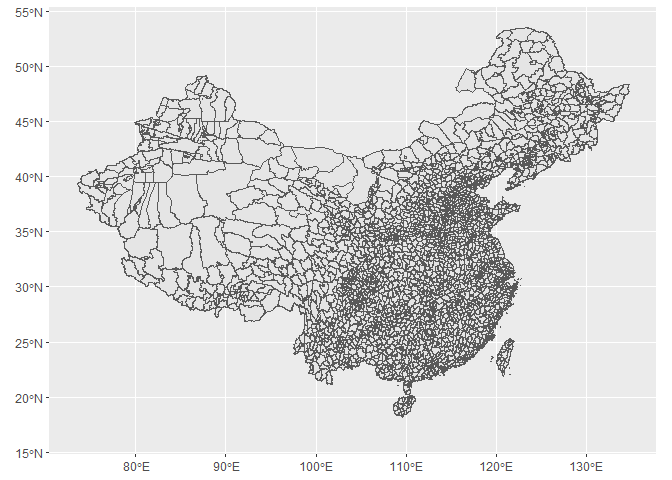
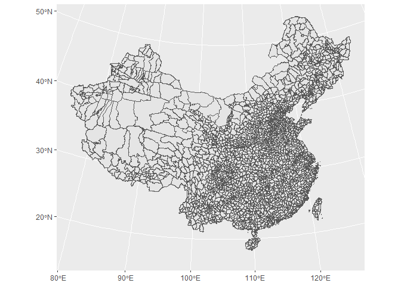
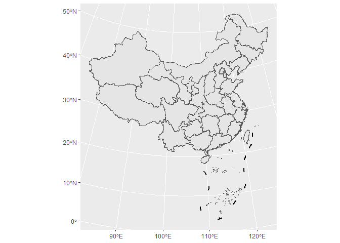
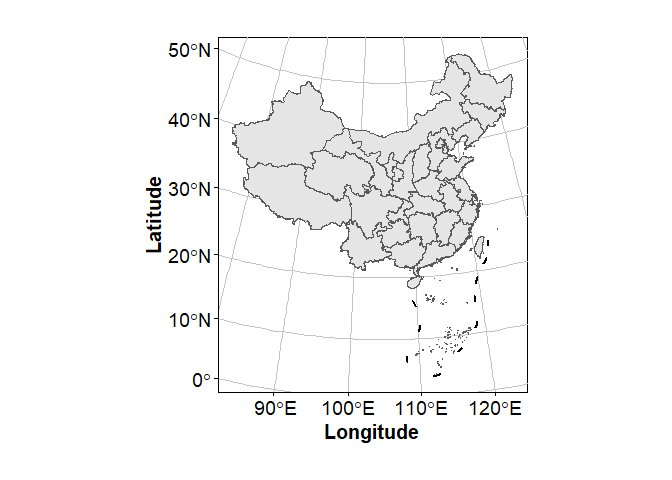

<!-- README.md is generated from README.Rmd. Please edit that file -->

# LYFtools

<!-- badges: start -->
<!-- badges: end -->

The `LYFtools` package is a collection of some of my frequently used
functions for easy use.

# Installation

If you’re interested, you can install the development version of
`LYFtools` like so:

    devtools::install_github('evanliu3594/LYFtools')

# Examples

There are some basic examples which shows you how to use `LYFtools`:

## Data incorporated

### `all_cn_chr`

A regex syntax to retrieve all Chinese characters form a string.

``` r
library(LYFtools)
library(tidyverse)
#> ── Attaching core tidyverse packages ──────────────────────── tidyverse 2.0.0 ──
#> ✔ dplyr     1.1.1     ✔ readr     2.1.4
#> ✔ forcats   1.0.0     ✔ stringr   1.5.0
#> ✔ ggplot2   3.4.1     ✔ tibble    3.2.1
#> ✔ lubridate 1.9.2     ✔ tidyr     1.3.0
#> ✔ purrr     1.0.1     
#> ── Conflicts ────────────────────────────────────────── tidyverse_conflicts() ──
#> ✖ dplyr::filter() masks stats::filter()
#> ✖ dplyr::lag()    masks stats::lag()
#> ℹ Use the ]8;;http://conflicted.r-lib.org/conflicted package]8;; to force all conflicts to become errors
stringr::str_extract("1234567，走南闯北吃东西abcdefg", all_cn_chr)
#> [1] "走南闯北吃东西"
```

### `cncrs`

A Albert projection setting to get better view of China map, see
examples in later mapping components.

### `cnmap_counties`

County-level map of China, a sf object. Inherited and simplied from
`mapchina` package.

``` r
cnmap_counties %>% ggplot() + geom_sf()
```



``` r
# see difference when projecting in `cncrs`
cnmap_counties %>% ggplot() + geom_sf() + coord_sf(crs = cncrs)
```



### `cnmap_9dx` and `cnmap_islands`

Far-sea islands and south China sea boundary.

``` r
library(sf)
#> Linking to GEOS 3.9.3, GDAL 3.5.2, PROJ 8.2.1; sf_use_s2() is TRUE
sf_use_s2(F)
#> Spherical geometry (s2) switched off

cnmap_provinces <- cnmap_counties %>% group_by(Code_Province) %>% 
  summarise(geometry = st_union(geometry))
#> although coordinates are longitude/latitude, st_union assumes that they are
#> planar
#> although coordinates are longitude/latitude, st_union assumes that they are
#> planar
#> although coordinates are longitude/latitude, st_union assumes that they are
#> planar
#> although coordinates are longitude/latitude, st_union assumes that they are
#> planar
#> although coordinates are longitude/latitude, st_union assumes that they are
#> planar
#> although coordinates are longitude/latitude, st_union assumes that they are
#> planar
#> although coordinates are longitude/latitude, st_union assumes that they are
#> planar
#> although coordinates are longitude/latitude, st_union assumes that they are
#> planar
#> although coordinates are longitude/latitude, st_union assumes that they are
#> planar
#> although coordinates are longitude/latitude, st_union assumes that they are
#> planar
#> although coordinates are longitude/latitude, st_union assumes that they are
#> planar
#> although coordinates are longitude/latitude, st_union assumes that they are
#> planar
#> although coordinates are longitude/latitude, st_union assumes that they are
#> planar
#> although coordinates are longitude/latitude, st_union assumes that they are
#> planar
#> although coordinates are longitude/latitude, st_union assumes that they are
#> planar
#> although coordinates are longitude/latitude, st_union assumes that they are
#> planar
#> although coordinates are longitude/latitude, st_union assumes that they are
#> planar
#> although coordinates are longitude/latitude, st_union assumes that they are
#> planar
#> although coordinates are longitude/latitude, st_union assumes that they are
#> planar
#> although coordinates are longitude/latitude, st_union assumes that they are
#> planar
#> although coordinates are longitude/latitude, st_union assumes that they are
#> planar
#> although coordinates are longitude/latitude, st_union assumes that they are
#> planar
#> although coordinates are longitude/latitude, st_union assumes that they are
#> planar
#> although coordinates are longitude/latitude, st_union assumes that they are
#> planar
#> although coordinates are longitude/latitude, st_union assumes that they are
#> planar
#> although coordinates are longitude/latitude, st_union assumes that they are
#> planar
#> although coordinates are longitude/latitude, st_union assumes that they are
#> planar
#> although coordinates are longitude/latitude, st_union assumes that they are
#> planar
#> although coordinates are longitude/latitude, st_union assumes that they are
#> planar
#> although coordinates are longitude/latitude, st_union assumes that they are
#> planar
#> although coordinates are longitude/latitude, st_union assumes that they are
#> planar
#> although coordinates are longitude/latitude, st_union assumes that they are
#> planar
#> although coordinates are longitude/latitude, st_union assumes that they are
#> planar
#> although coordinates are longitude/latitude, st_union assumes that they are
#> planar

ggplot() + 
  geom_sf(data = cnmap_provinces) +
  geom_sf(data = cnmap_9dx, linewidth = 1) +
  geom_sf(data = cnmap_islands) +
  coord_sf(crs = cncrs)
```



## functions

### `larger_bbox()`

`larger_bbox()` is used to get a broader bounding box of a given sf/sfc
object. The result is more suitable for generating a fishnet raster.

``` r
st_bbox(cnmap_counties) %>% 
  stars::st_as_stars(dx = 0.1, dy = 0.1)
#> stars object with 2 dimensions and 1 attribute
#> attribute(s):
#>         Min. 1st Qu. Median Mean 3rd Qu. Max.
#> values     0       0      0    0       0    0
#> dimension(s):
#>   from  to  offset delta refsys x/y
#> x    1 613 73.5008   0.1 WGS 84 [x]
#> y    1 370 53.5608  -0.1 WGS 84 [y]

larger_bbox(cnmap_counties, precise = 0.1) %>% 
  stars::st_as_stars(dx = 0.1, dy = 0.1)
#> stars object with 2 dimensions and 1 attribute
#> attribute(s):
#>         Min. 1st Qu. Median Mean 3rd Qu. Max.
#> values     0       0      0    0       0    0
#> dimension(s):
#>   from  to offset delta refsys x/y
#> x    1 614   73.5   0.1 WGS 84 [x]
#> y    1 370   53.6  -0.1 WGS 84 [y]

larger_bbox(cnmap_counties, precise = 10) %>% 
  stars::st_as_stars(dx = 10, dy = 10)
#> stars object with 2 dimensions and 1 attribute
#> attribute(s):
#>         Min. 1st Qu. Median Mean 3rd Qu. Max.
#> values     0       0      0    0       0    0
#> dimension(s):
#>   from to offset delta refsys x/y
#> x    1  7     70    10 WGS 84 [x]
#> y    1  5     60   -10 WGS 84 [y]
```

### `simple_date()`

`simple_date()` is to acquire a abbreviation of the date.

``` r
simple_date()
#> [1] "230419"
simple_date(as.Date("2023-09-09"))
#> [1] "230909"
simple_date("2025-12-28")
#> [1] "251228"

# useful when generating file names
str_glue("./this_is_the_filename_with_creating_date_{simple_date()}.R")
#> ./this_is_the_filename_with_creating_date_230419.R
```

### `dir_validate()`

`dir_validate()` checks the given file path to see whether it contains
of any non-existing folder. If yes, this function automatically creates
these folders to ensure the path is available. Useful when generating a
file name for saving.

``` r
writeLines("abc", dir_validate("~/THE/FILE/PATH/THAT/YOU/WANT/TO/TEST.abc"))
```

see results, run blow code:

``` r
utils::browseURL("~/THE/FILE/PATH/THAT/YOU/WANT/TO/")
```

### `convert_amount()`

`convert_amount()` is used for convert and reform the values between
Chinese quantifiers

``` r
convert_amount(66, "兆瓦", "万千瓦")
#> [1] 6.6

convert_amount(1.7, "米", "毫米")
#> [1] 1700

convert_amount(9600000, "平方公里", "平方米")
#> [1] 9.6e+12
```

### `convert_coord()`

`convert_coord()` is used for convert a set of geo-coding (long, lat)
between some Chinese defined coordinate systems and WGS1984 coordinate
system. Note that only works inside China domain

``` r
convert_coord(133, 47, from = "GCJ02", to = "WGS84")
#>       lng       lat 
#> 132.99251  46.99768
```

### `Evantheme()`

A Yifan LIU-defined ggplot theme, already applied into my publications.

``` r
ggplot() + 
  geom_sf(data = cnmap_provinces) +
  geom_sf(data = cnmap_9dx, linewidth = 1) +
  geom_sf(data = cnmap_islands) +
  coord_sf(crs = cncrs) +
  scale_x_continuous(name = "Longitude") +
  scale_y_continuous(name =  "Latitude") +
  Evantheme()
```


